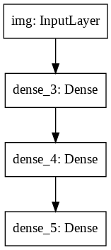
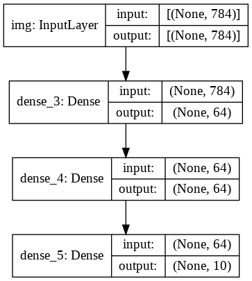
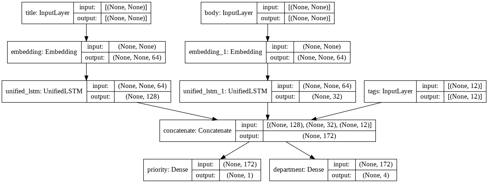
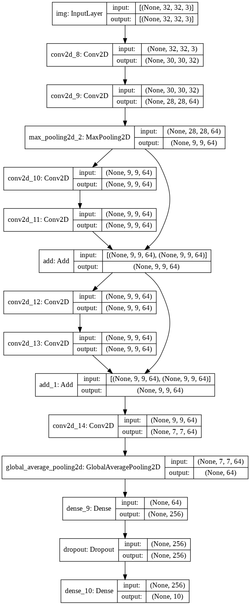

# TensorFlow中的Keras函数式API (tensorflow2.0官方教程翻译)

> 最新版本：[https://www.mashangxue123.com/tensorflow/tf2-guide-keras-functional.html](https://www.mashangxue123.com/tensorflow/tf2-guide-keras-functional.html)
> 英文版本：[https://tensorflow.google.cn/alpha/guide/keras/functional](https://tensorflow.google.cn/alpha/guide/keras/functional)
> 翻译建议PR：[https://github.com/mashangxue/tensorflow2-zh/edit/master/r2/guide/keras/functional.md](https://github.com/mashangxue/tensorflow2-zh/edit/master/r2/guide/keras/functional.md)

## 设置

安装

```
pip install pydot
apt-get install graphviz
```

导入库
```python
from __future__ import absolute_import, division, print_function, unicode_literals

import tensorflow as tf

tf.keras.backend.clear_session()  # For easy reset of notebook state.
```


## 介绍

您已经熟悉使用 `keras.Sequential()` 来创建模型。函数式 API是一种创建比 `Sequential` 更灵活的模型的方法：它可以处理具有非线性拓扑的模型，具有共享层的模型以及具有多个输入或输出的模型。

它基于这样一种思想，即深度学习模型通常是由层组成的有向无环图(DAG)。函数API是一组用于构建层图的工具。

考虑以下模型：

```python
(input: 784-dimensional vectors)
       ↧
[Dense (64 units, relu activation)]
       ↧
[Dense (64 units, relu activation)]
       ↧
[Dense (10 units, softmax activation)]
       ↧
(output: probability distribution over 10 classes)
```

这是一个3层的简单图表。
要使用函数API构建这个模型，首先要创建一个输入节点:

```python
from tensorflow import keras

inputs = keras.Input(shape=(784,))
```

这里我们只指定数据的形状：784维向量。无论总是省略批量大小，我们只指定每个样本的形状。对于用于形状 `(32, 32, 3)` 的图像的输入，我们将使用：

```python
img_inputs = keras.Input(shape=(32, 32, 3))
```

返回的内容，`inputs`，包含有关您希望提供给模型的输入数据的形状和类型的信息：

```python
inputs.shape

inputs.dtype
```


```
    TensorShape([None, 784])
    tf.float32
```


通过调用这个输入对象上的一个层，可以在层图中创建一个新节点:

```python
from tensorflow.keras import layers

dense = layers.Dense(64, activation='relu')
x = dense(inputs)
```

“层调用”操作就像从“输入”向我们创建的这个层绘制一个箭头。我们把输入“传递”到 `dense` 层，得到x。

让我们在图层中添加几个层：

```python
x = layers.Dense(64, activation='relu')(x)
outputs = layers.Dense(10, activation='softmax')(x)
```

此时，我们可以通过在图层中指定其输入和输出来创建模型：

```python
model = keras.Model(inputs=inputs, outputs=outputs)
```

回顾一下，这是我们的完整模型定义过程：

```python
inputs = keras.Input(shape=(784,), name='img')
x = layers.Dense(64, activation='relu')(inputs)
x = layers.Dense(64, activation='relu')(x)
outputs = layers.Dense(10, activation='softmax')(x)

model = keras.Model(inputs=inputs, outputs=outputs, name='mnist_model')
```

让我们看一下模型摘要的样子：

```python
model.summary()
```

```
    Model: "mnist_model"
    _________________________________________________________________
    Layer (type)                 Output Shape              Param #
    =================================================================
    img (InputLayer)             [(None, 784)]             0
    _________________________________________________________________
    dense_3 (Dense)              (None, 64)                50240
    _________________________________________________________________
    dense_4 (Dense)              (None, 64)                4160
    _________________________________________________________________
    dense_5 (Dense)              (None, 10)                650
    =================================================================
    Total params: 55,050
    Trainable params: 55,050
    Non-trainable params: 0
    _________________________________________________________________
```

我们还可以将模型绘制为图形：

```python
keras.utils.plot_model(model, 'my_first_model.png')
```




并可选择在绘制的图形中显示每个图层的输入和输出形状：

```python
keras.utils.plot_model(model, 'my_first_model_with_shape_info.png', show_shapes=True)
```



这个图和我们编写的代码几乎完全相同。在代码版本中，连接箭头只是由调用操作替换。

 "graph of layers" 是深度学习模型的非常直观的心理图像，而函数API是一种创建模型的方法，可以很好地反映这种心理图像。


## 训练、评估和推理

对于使用函数API构建的模型和顺序模型，评估和推理的工作方式完全相同。

这是一个快速演示。

在这里，我们加载MNIST图像数据，将其重新整形为矢量，使模型适合数据（同时监控验证分割的性能），最后我们在测试数据上评估我们的模型：

```python
(x_train, y_train), (x_test, y_test) = keras.datasets.mnist.load_data()
x_train = x_train.reshape(60000, 784).astype('float32') / 255
x_test = x_test.reshape(10000, 784).astype('float32') / 255

model.compile(loss='sparse_categorical_crossentropy',
              optimizer=keras.optimizers.RMSprop(),
              metrics=['accuracy'])
history = model.fit(x_train, y_train,
                    batch_size=64,
                    epochs=5,
                    validation_split=0.2)
test_scores = model.evaluate(x_test, y_test, verbose=0)
print('Test loss:', test_scores[0])
print('Test accuracy:', test_scores[1])
```

```
    Train on 48000 samples, validate on 12000 samples
    ......
    Epoch 5/5
    48000/48000 [==============================] - 3s 55us/sample - loss: 0.0759 - accuracy: 0.9770 - val_loss: 0.1139 - val_accuracy: 0.9670
    Test loss: 0.100577776569454
    Test accuracy: 0.9696
```

有关模型训练和评估的完整指南，请参阅[训练和评估指南](https://tensorflow.google.cn/alpha/guide/keras/training_and_evaluation)。

## 保存和序列化

对于使用函数API构建的模型和顺序模型，保存和序列化的工作方式完全相同。

保存函数模型的标准方法是调用model.save()将整个模型保存到一个文件中。稍后，您可以从该文件重新创建相同的模型，即使您不再能够访问创建模型的代码。

这个文件包括:
- 该模型的架构
- 模型的权重值（在训练期间学到的）
- 模型的训练配置（你传递给`compile`的东西），如果有的话
- 优化器及其状态（如果有的话）（这使您可以从中断的地方重新启动训练）


```python
model.save('path_to_my_model.h5')
del model
# Recreate the exact same model purely from the file:
model = keras.models.load_model('path_to_my_model.h5')
```

有关模型保存的完整指南，请参阅[保存和序列化模型指南](https://tensorflow.google.cn/alpha/guide/keras/saving_and_serializing)。

## 使用相同的层图来定义多个模型

在函数API中，通过在层图中指定它们的输入和输出来创建模型。这意味着一个图层图可以用来生成多个模型。

在下面的示例中，我们使用相同的层堆栈来实例化两个模型:将图像输入转换为16维向量的编码器 `encoder` 模型，以及用于训练的端到端自动编码器`autoencoder`模型。

```python
encoder_input = keras.Input(shape=(28, 28, 1), name='img')
x = layers.Conv2D(16, 3, activation='relu')(encoder_input)
x = layers.Conv2D(32, 3, activation='relu')(x)
x = layers.MaxPooling2D(3)(x)
x = layers.Conv2D(32, 3, activation='relu')(x)
x = layers.Conv2D(16, 3, activation='relu')(x)
encoder_output = layers.GlobalMaxPooling2D()(x)

encoder = keras.Model(encoder_input, encoder_output, name='encoder')
encoder.summary()

x = layers.Reshape((4, 4, 1))(encoder_output)
x = layers.Conv2DTranspose(16, 3, activation='relu')(x)
x = layers.Conv2DTranspose(32, 3, activation='relu')(x)
x = layers.UpSampling2D(3)(x)
x = layers.Conv2DTranspose(16, 3, activation='relu')(x)
decoder_output = layers.Conv2DTranspose(1, 3, activation='relu')(x)

autoencoder = keras.Model(encoder_input, decoder_output, name='autoencoder')
autoencoder.summary()
```

请注意，我们使解码架构与编码架构严格对称，因此我们得到的输出形状与输入形状`（28,28,1）`相同。`Conv2D` 层的反面是 `Conv2DTranspose` 层`MaxPooling2D` 层的反面是 `UpSampling2D` 层。

## 所有模型都可以调用，就像层一样

您可以将任何模型视为一个图层，方法是在输入或另一个图层的输出上调用它。请注意，通过调用模型，您不仅可以重用模型的体系结构，还可以重用其权重。

让我们看看它是如何运作的。以下是对自动编码器示例的不同看法，该示例创建编码器模型，解码器模型，并在两次调用中链接它们以获取自动编码器模型：

```python
encoder_input = keras.Input(shape=(28, 28, 1), name='original_img')
x = layers.Conv2D(16, 3, activation='relu')(encoder_input)
x = layers.Conv2D(32, 3, activation='relu')(x)
x = layers.MaxPooling2D(3)(x)
x = layers.Conv2D(32, 3, activation='relu')(x)
x = layers.Conv2D(16, 3, activation='relu')(x)
encoder_output = layers.GlobalMaxPooling2D()(x)

encoder = keras.Model(encoder_input, encoder_output, name='encoder')
encoder.summary()

decoder_input = keras.Input(shape=(16,), name='encoded_img')
x = layers.Reshape((4, 4, 1))(decoder_input)
x = layers.Conv2DTranspose(16, 3, activation='relu')(x)
x = layers.Conv2DTranspose(32, 3, activation='relu')(x)
x = layers.UpSampling2D(3)(x)
x = layers.Conv2DTranspose(16, 3, activation='relu')(x)
decoder_output = layers.Conv2DTranspose(1, 3, activation='relu')(x)

decoder = keras.Model(decoder_input, decoder_output, name='decoder')
decoder.summary()

autoencoder_input = keras.Input(shape=(28, 28, 1), name='img')
encoded_img = encoder(autoencoder_input)
decoded_img = decoder(encoded_img)
autoencoder = keras.Model(autoencoder_input, decoded_img, name='autoencoder')
autoencoder.summary()
```

如您所见，模型可以嵌套：模型可以包含子模型（因为模型就像一个层）。

模型嵌套的常见用例是集成。作为一个例子，这里是如何将一组模型集成到一个平均其预测的模型中：

```python
def get_model():
  inputs = keras.Input(shape=(128,))
  outputs = layers.Dense(1, activation='sigmoid')(inputs)
  return keras.Model(inputs, outputs)

model1 = get_model()
model2 = get_model()
model3 = get_model()

inputs = keras.Input(shape=(128,))
y1 = model1(inputs)
y2 = model2(inputs)
y3 = model3(inputs)
outputs = layers.average([y1, y2, y3])
ensemble_model = keras.Model(inputs=inputs, outputs=outputs)
```

## 操纵复杂的图形拓扑


### 具有多个输入和输出的模型


functional API使操作多个输入和输出变得容易。使用Sequential API无法处理此问题。

这是一个简单的例子。

假设您正在构建一个系统，按照优先级对定制的发行票据进行排序，并将它们路由到正确的部门。

你的模型将有3个输入：
- 票证标题（文字输入）
- 票证的文本正文（文本输入）
- 用户添加的任何标签（分类输入）

它将有两个输出：

- 优先级在0到1之间（标量sigmoid输出）
- 应该处理票据的部门(各部门之间的softmax输出)

让我们用Functional API在几行中构建这个模型。

```python
num_tags = 12  # Number of unique issue tags
num_words = 10000  # Size of vocabulary obtained when preprocessing text data
num_departments = 4  # Number of departments for predictions

title_input = keras.Input(shape=(None,), name='title')  # Variable-length sequence of ints
body_input = keras.Input(shape=(None,), name='body')  # Variable-length sequence of ints
tags_input = keras.Input(shape=(num_tags,), name='tags')  # Binary vectors of size `num_tags`

# Embed each word in the title into a 64-dimensional vector
title_features = layers.Embedding(num_words, 64)(title_input)
# Embed each word in the text into a 64-dimensional vector
body_features = layers.Embedding(num_words, 64)(body_input)

# Reduce sequence of embedded words in the title into a single 128-dimensional vector
title_features = layers.LSTM(128)(title_features)
# Reduce sequence of embedded words in the body into a single 32-dimensional vector
body_features = layers.LSTM(32)(body_features)

# Merge all available features into a single large vector via concatenation
x = layers.concatenate([title_features, body_features, tags_input])

# Stick a logistic regression for priority prediction on top of the features
priority_pred = layers.Dense(1, activation='sigmoid', name='priority')(x)
# Stick a department classifier on top of the features
department_pred = layers.Dense(num_departments, activation='softmax', name='department')(x)

# Instantiate an end-to-end model predicting both priority and department
model = keras.Model(inputs=[title_input, body_input, tags_input],
                    outputs=[priority_pred, department_pred])
```

让我们绘制模型：

```python
keras.utils.plot_model(model, 'multi_input_and_output_model.png', show_shapes=True)
```




编译此模型时，我们可以为每个输出分配不同的损耗。您甚至可以为每个损失分配不同的权重，以调整它们对总训练损失的贡献。

```python
model.compile(optimizer=keras.optimizers.RMSprop(1e-3),
              loss=['binary_crossentropy', 'categorical_crossentropy'],
              loss_weights=[1., 0.2])
```

由于我们为输出图层指定了名称，因此我们也可以像这样指定损失：

```python
model.compile(optimizer=keras.optimizers.RMSprop(1e-3),
              loss={'priority': 'binary_crossentropy',
                    'department': 'categorical_crossentropy'},
              loss_weights=[1., 0.2])
```

我们可以通过传递Numpy输入和目标数组列表来训练模型：

```python
import numpy as np

# Dummy input data
title_data = np.random.randint(num_words, size=(1280, 10))
body_data = np.random.randint(num_words, size=(1280, 100))
tags_data = np.random.randint(2, size=(1280, num_tags)).astype('float32')
# Dummy target data
priority_targets = np.random.random(size=(1280, 1))
dept_targets = np.random.randint(2, size=(1280, num_departments))

model.fit({'title': title_data, 'body': body_data, 'tags': tags_data},
          {'priority': priority_targets, 'department': dept_targets},
          epochs=2,
          batch_size=32)
```

```
    ....
    Epoch 2/2
    1280/1280 [==============================] - 11s 9ms/sample - loss: 1.2137 - priority_loss: 0.6489 - department_loss: 2.8242
```

当使用`Dataset`对象调用fit时，它应该产生一个列表元组，如 `([title_data, body_data, tags_data], [priority_targets, dept_targets])` 或者一个字典的元组 `({'title': title_data, 'body': body_data, 'tags': tags_data}, {'priority': priority_targets, 'department': dept_targets})`。

有关更详细的说明，请参阅完整的[训练和评估指南](https://tensorflow.google.cn/alpha/guide/keras/training_and_evaluation)。


### 一个玩具resnet模型

除了具有多个输入和输出的模型之外，Functional API还可以轻松地操作非线性连接拓扑，也就是说，层不按顺序连接的模型。这也无法使用Sequential API处理（如名称所示）。

一个常见的用例是残差连接。

让我们为CIFAR10构建一个玩具ResNet模型来演示这个

```python
inputs = keras.Input(shape=(32, 32, 3), name='img')
x = layers.Conv2D(32, 3, activation='relu')(inputs)
x = layers.Conv2D(64, 3, activation='relu')(x)
block_1_output = layers.MaxPooling2D(3)(x)

x = layers.Conv2D(64, 3, activation='relu', padding='same')(block_1_output)
x = layers.Conv2D(64, 3, activation='relu', padding='same')(x)
block_2_output = layers.add([x, block_1_output])

x = layers.Conv2D(64, 3, activation='relu', padding='same')(block_2_output)
x = layers.Conv2D(64, 3, activation='relu', padding='same')(x)
block_3_output = layers.add([x, block_2_output])

x = layers.Conv2D(64, 3, activation='relu')(block_3_output)
x = layers.GlobalAveragePooling2D()(x)
x = layers.Dense(256, activation='relu')(x)
x = layers.Dropout(0.5)(x)
outputs = layers.Dense(10, activation='softmax')(x)

model = keras.Model(inputs, outputs, name='toy_resnet')
model.summary()
```


让我们绘制模型：

```python
keras.utils.plot_model(model, 'mini_resnet.png', show_shapes=True)
```




我们来训练吧：

```python
(x_train, y_train), (x_test, y_test) = keras.datasets.cifar10.load_data()
x_train = x_train.astype('float32') / 255.
x_test = x_test.astype('float32') / 255.
y_train = keras.utils.to_categorical(y_train, 10)
y_test = keras.utils.to_categorical(y_test, 10)

model.compile(optimizer=keras.optimizers.RMSprop(1e-3),
              loss='categorical_crossentropy',
              metrics=['acc'])
model.fit(x_train, y_train,
          batch_size=64,
          epochs=1,
          validation_split=0.2)
```

```
    Train on 40000 samples, validate on 10000 samples
    40000/40000 [==============================] - 318s 8ms/sample - loss: 1.9034 - acc: 0.2767 - val_loss: 1.6173 - val_acc: 0.3870
```

## 共享图层

函数式API的另一个好用途是使用共享层的模型。共享图层是在同一模型中多次重复使用的图层实例：它们学习与层图中的多个路径对应的特征。

共享层通常用于编码来自类似空间的输入（例如，两个不同的文本，具有相似的词汇表），因为它们可以在这些不同的输入上共享信息，并且可以在更少的时间内训练这样的模型数据。如果在其中一个输入中看到给定的单词，那将有利于处理通过共享层的所有输入。

要在Functional API中共享图层，只需多次调用同一图层实例即可。例如，这是一个跨两个不同文本输入共享的嵌入`Embedding` 层：

```python
# Embedding for 1000 unique words mapped to 128-dimensional vectors
shared_embedding = layers.Embedding(1000, 128)

# Variable-length sequence of integers
text_input_a = keras.Input(shape=(None,), dtype='int32')

# Variable-length sequence of integers
text_input_b = keras.Input(shape=(None,), dtype='int32')

# We reuse the same layer to encode both inputs
encoded_input_a = shared_embedding(text_input_a)
encoded_input_b = shared_embedding(text_input_b)
```

## 提取和重用图层中的节点

因为您在Functional API中操作的层图是静态数据结构，所以可以访问和检查它。这就是我们如何将功能模型绘制为图像的方式。

这也意味着我们可以访问中间层的激活（图中的“节点”）并在其他地方重用它们。例如，这对于特征提取非常有用！

让我们看一个例子。这是一个在ImageNet上预先训练权重的VGG19模型:

```python
from tensorflow.keras.applications import VGG19

vgg19 = VGG19()
```

这些是模型的中间激活，通过查询图形数据结构获得：

```python
features_list = [layer.output for layer in vgg19.layers]
```

我们可以使用这些功能来创建一个新的特征提取模型，它返回中间层激活的值（我们可以在3行中完成所有这些操作）。

```python
feat_extraction_model = keras.Model(inputs=vgg19.input, outputs=features_list)

img = np.random.random((1, 224, 224, 3)).astype('float32')
extracted_features = feat_extraction_model(img)
```

除了其他方面，这在[实现神经风格迁移](https://medium.com/tensorflow/neural-style-transfer-creating-art-with-deep-learning-using-tf-keras-and-eager-execution-7d541ac31398)时派上用场。

## 通过编写自定义图层来扩展API

tf.keras拥有广泛的内置层。这里有一些例子：

- 卷积层Convolutional layers: `Conv1D`, `Conv2D`, `Conv3D`, `Conv2DTranspose`, etc.
- 池化层Pooling layers: `MaxPooling1D`, `MaxPooling2D`, `MaxPooling3D`, `AveragePooling1D`, etc.
- RNN 层: `GRU`, `LSTM`, `ConvLSTM2D`, etc.
- `BatchNormalization`, `Dropout`, `Embedding`, etc.

如果找不到所需的内容，可以通过创建自己的图层来扩展API。

所有图层都是`Layer`类的子类，并实现：
- 一个 `call` 方法，指定由层完成的计算。
- 一个`build`方法，它创建了图层的权重（请注意，这只是一种样式约定;您也可以在 `__init__` 中创建权重）。

要了解有关从头开始创建图层的更多信息，请查看该指南 [Guide to writing layers and models from scratch](https://tensorflow.google.cn/alpha/guide/keras/custom_layers_and_models).

这是一个`Dense`层的简单实现：

```python
class CustomDense(layers.Layer):

  def __init__(self, units=32):
    super(CustomDense, self).__init__()
    self.units = units

  def build(self, input_shape):
    self.w = self.add_weight(shape=(input_shape[-1], self.units),
                             initializer='random_normal',
                             trainable=True)
    self.b = self.add_weight(shape=(self.units,),
                             initializer='random_normal',
                             trainable=True)

  def call(self, inputs):
    return tf.matmul(inputs, self.w) + self.b

inputs = keras.Input((4,))
outputs = CustomDense(10)(inputs)

model = keras.Model(inputs, outputs)
```

如果希望自定义层支持序列化，还应定义 `get_config` 方法，该方法返回层实例的构造函数参数：

```python
class CustomDense(layers.Layer):

  def __init__(self, units=32):
    super(CustomDense, self).__init__()
    self.units = units

  def build(self, input_shape):
    self.w = self.add_weight(shape=(input_shape[-1], self.units),
                             initializer='random_normal',
                             trainable=True)
    self.b = self.add_weight(shape=(self.units,),
                             initializer='random_normal',
                             trainable=True)

  def call(self, inputs):
    return tf.matmul(inputs, self.w) + self.b

  def get_config(self):
    return {'units': self.units}


inputs = keras.Input((4,))
outputs = CustomDense(10)(inputs)

model = keras.Model(inputs, outputs)
config = model.get_config()

new_model = keras.Model.from_config(
    config, custom_objects={'CustomDense': CustomDense})
```

或者，你也可以实现类方法 `from_config(cls, config)` ，它负责在给定配置字典的情况下重新创建一个层实例。`from_config` 的默认实现是：

```python
def from_config(cls, config):
  return cls(**config)
```

## 何时使用函数API

如何决定是使用Functional API创建新模型，还是直接将`Model`类继承？

通常，Functional API更高级，更容易和更安全使用，并且具有子模型不支持的许多功能。

但是，在创建不易表达为层的有向非循环图的模型时，模型子类化为您提供了更大的灵活性（例如，您无法使用Functional API实现Tree-RNN，您必须直接将`Model`子类化）。

### 以下是Functional API的优势：

下面列出的属性对于Sequential模型也是如此（它们也是数据结构），但对于子类模型（Python字节码，而不是数据结构）则不然。

#### 它不那么冗长。

No `super(MyClass, self).__init__(...)`, no `def call(self, ...):`, etc.

比较:

```python
inputs = keras.Input(shape=(32,))
x = layers.Dense(64, activation='relu')(inputs)
outputs = layers.Dense(10)(x)
mlp = keras.Model(inputs, outputs)
```

使用子类型:

```python
class MLP(keras.Model):

  def __init__(self, **kwargs):
    super(MLP, self).__init__(**kwargs)
    self.dense_1 = layers.Dense(64, activation='relu')
    self.dense_2 = layers.Dense(10)

  def call(self, inputs):
    x = self.dense_1(inputs)
    return self.dense_2(x)

# Instantiate the model.
mlp = MLP()
# Necessary to create the model's state.
# The model doesn't have a state until it's called at least once.
_ = mlp(tf.zeros((1, 32)))
```


#### 它在您定义模型时验证您的模型。

在Functional API中，您的输入规范（shape和dtype）是事先创建的（通过`Input`），每次调用一个图层时，图层都会检查传递给它的规范是否符合其假设，并且它会引发一个如果没有帮助错误消息。

这可以保证您可以运行使用Functional API构建的任何模型。所有调试（与收敛相关的调试除外）将在模型构建期间静态发生，而不是在执行时发生。这类似于编译器中的类型检查。

#### 您的 Functional 模型是可绘图和可检查的。

您可以将模型绘制为图形，并且可以轻松访问此图中的中间节点 - 例如，提取和重用中间层的激活，如前面的示例中所示：

```python
features_list = [layer.output for layer in vgg19.layers]
feat_extraction_model = keras.Model(inputs=vgg19.input, outputs=features_list)
```


#### 您的 Functional 模型可以序列化或克隆。

因为 Functional 模型是一种数据结构而不是一段代码，所以它可以安全地序列化，并且可以保存为单个文件，允许您重新创建完全相同的模型，而无需访问任何原始代码。有关详细信息，请参阅我们的保存和序列化指南。

### 以下是Functional API的弱点:


#### 它不支持动态架构。

Functional API将模型视为图层的DAG。对于大多数深度学习体系结构都是如此，但并非全部：例如，递归网络或树RNN不遵循此假设，并且无法在Functional API中实现。

#### 有时，您只需要从头开始编写所有内容。

在编写高级架构时，您可能希望执行“定义层的DAG”范围之外的事情：例如，您可能希望在模型实例上公开多个自定义训练和推理方法。这需要子类化。

---

为了更深入地了解Functional API和Model子类之间的差异，您可以阅读 [What are Symbolic and Imperative APIs in TensorFlow 2.0?](https://medium.com/tensorflow/what-are-symbolic-and-imperative-apis-in-tensorflow-2-0-dfccecb01021).

## 混合和匹配不同的API样式

重要的是，在Functional API或Model子类化之间进行选择并不是一个二元决策，它将您限制为一类模型。tf.keras API中的所有模型都可以与每个模型进行交互，无论它们是顺序模型，功能模型还是从头开始编写的子类模型/层。

您始终可以使用Functional模型或Sequential模型作为子类 Model/Layer 的一部分：

```python
units = 32
timesteps = 10
input_dim = 5

# Define a Functional model
inputs = keras.Input((None, units))
x = layers.GlobalAveragePooling1D()(inputs)
outputs = layers.Dense(1, activation='sigmoid')(x)
model = keras.Model(inputs, outputs)


class CustomRNN(layers.Layer):

  def __init__(self):
    super(CustomRNN, self).__init__()
    self.units = units
    self.projection_1 = layers.Dense(units=units, activation='tanh')
    self.projection_2 = layers.Dense(units=units, activation='tanh')
    # Our previously-defined Functional model
    self.classifier = model

  def call(self, inputs):
    outputs = []
    state = tf.zeros(shape=(inputs.shape[0], self.units))
    for t in range(inputs.shape[1]):
      x = inputs[:, t, :]
      h = self.projection_1(x)
      y = h + self.projection_2(state)
      state = y
      outputs.append(y)
    features = tf.stack(outputs, axis=1)
    print(features.shape)
    return self.classifier(features)

rnn_model = CustomRNN()
_ = rnn_model(tf.zeros((1, timesteps, input_dim)))
```

    (1, 10, 32)


相反，只要它实现了一个遵循以下模式之一的`call`方法，你就可以在Functional API中使用任何子类Layer或Model：

- `call(self, inputs, **kwargs)`  其中 `inputs` 是张量或张量的张量结构（例如张量列表），其中 `**kwargs` 是非张量参数（非输入）。
- `call(self, inputs, training=None, **kwargs)` 其中 `training` 是一个布尔值，表示该层是否应该在训练模式和推理模式下运行。
- `call(self, inputs, mask=None, **kwargs)` 其中 `mask` 是布尔掩码张量（例如对RNN有用）。
- `call(self, inputs, training=None, mask=None, **kwargs)` -- 当然，您可以同时具有屏蔽和特定于训练的行为。

此外，如果在自定义图层或模型上实现 `get_config` 方法，则使用它创建的功能模型仍将是可序列化和可克隆的。

这是一个快速示例，我们在Functional模型中使用从头开始编写的自定义RNN：

```python
units = 32
timesteps = 10
input_dim = 5
batch_size = 16


class CustomRNN(layers.Layer):

  def __init__(self):
    super(CustomRNN, self).__init__()
    self.units = units
    self.projection_1 = layers.Dense(units=units, activation='tanh')
    self.projection_2 = layers.Dense(units=units, activation='tanh')
    self.classifier = layers.Dense(1, activation='sigmoid')

  def call(self, inputs):
    outputs = []
    state = tf.zeros(shape=(inputs.shape[0], self.units))
    for t in range(inputs.shape[1]):
      x = inputs[:, t, :]
      h = self.projection_1(x)
      y = h + self.projection_2(state)
      state = y
      outputs.append(y)
    features = tf.stack(outputs, axis=1)
    return self.classifier(features)

# Note that we specify a static batch size for the inputs with the `batch_shape`
# arg, because the inner computation of `CustomRNN` requires a static batch size
# (when we create the `state` zeros tensor).
inputs = keras.Input(batch_shape=(batch_size, timesteps, input_dim))
x = layers.Conv1D(32, 3)(inputs)
outputs = CustomRNN()(x)

model = keras.Model(inputs, outputs)

rnn_model = CustomRNN()
_ = rnn_model(tf.zeros((1, 10, 5)))
```

这就是我们关于函数API的指南的全部内容!

现在，您已经拥有了一套用于构建深度学习模型的强大工具。

> 最新版本：[https://www.mashangxue123.com/tensorflow/tf2-guide-keras-functional.html](https://www.mashangxue123.com/tensorflow/tf2-guide-keras-functional.html)
> 英文版本：[https://tensorflow.google.cn/alpha/guide/keras/functional](https://tensorflow.google.cn/alpha/guide/keras/functional)
> 翻译建议PR：[https://github.com/mashangxue/tensorflow2-zh/edit/master/r2/guide/keras/functional.md](https://github.com/mashangxue/tensorflow2-zh/edit/master/r2/guide/keras/functional.md)
